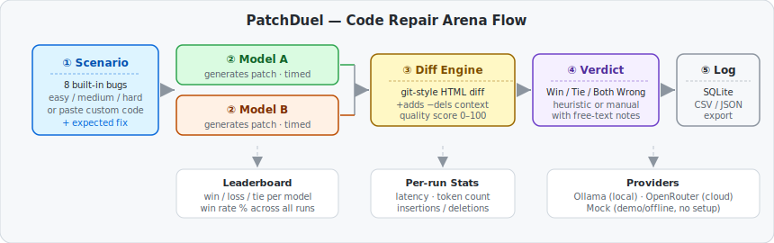
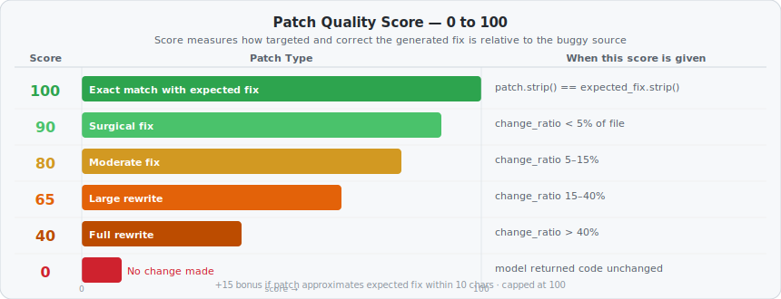

# PatchDuel — Local LLM Code Repair Arena

> *Made autonomously using [NEO](https://heyneo.so) · [](https://marketplace.visualstudio.com/items?itemName=NeoResearchInc.heyneo)*

[](https://www.python.org/downloads/)
[](https://opensource.org/licenses/MIT)
[](tests/)

> Stop guessing which local model fixes code best — see the exact diffs, get a quality score, and log every verdict to SQLite.

## What it does

PatchDuel is a Gradio-based arena that pits two LLMs head-to-head on code repair tasks. You pick a buggy snippet (or paste your own), both models generate a fix simultaneously, and you get a split-screen git-style diff for each — with timing, token counts, and a 0–100 quality score. Every run is logged locally to SQLite so you can build a real leaderboard over time.



## Install

```bash
git clone https://github.com/dakshjain-1616/patchduel-local-llm-code-repai
cd patchduel-local-llm-code-repai
pip install -r requirements.txt
```

## Quickstart

### Gradio UI (recommended)

```bash
python app.py
# Open http://localhost:7860
```

No API keys needed — select **Mock** as the provider to run a full duel offline with deterministic output.

### Programmatic usage

```python
from patchduel_local_llm_ import (
    repair_code,
    render_html_diff,
    compute_quality_score,
    save_run,
    heuristic_winner,
)

buggy = "def add(a, b):\n    return a - b  # Bug"
expected = "def add(a, b):\n    return a + b"

patch_a = repair_code("llama3.2", buggy)
patch_b = repair_code("mistral", buggy)

score_a = compute_quality_score(buggy, patch_a, expected)
score_b = compute_quality_score(buggy, patch_b, expected)
winner  = heuristic_winner(buggy, patch_a, patch_b, expected)

print(f"Model A score: {score_a}  |  Model B score: {score_b}  |  Winner: {winner}")

save_run("llama3.2", "mistral", buggy, patch_a, patch_b, winner=winner)
```

## Providers

| Provider | Setup | Best for |
|---|---|---|
| **Ollama** | `ollama serve` running locally | Local models, no API cost, fully private |
| **OpenRouter** | `OPENROUTER_API_KEY=...` in `.env` | Cloud models (GPT-4o, Claude, Mistral, etc.) |
| **Mock** | No setup | Demo mode, CI tests, offline development |

### Ollama setup

```bash
# Install Ollama: https://ollama.com
ollama pull llama3.2
ollama pull mistral
python app.py
```

### OpenRouter setup

```bash
# .env
OPENROUTER_API_KEY=sk-or-...
DEFAULT_OPENROUTER_MODEL_A=openai/gpt-5.4-mini
DEFAULT_OPENROUTER_MODEL_B=mistralai/mistral-small-2603
```

## Quality scoring



Each patch receives a score 0–100:

| Score | Meaning | Condition |
|---|---|---|
| **100** | Exact match | `patch == expected_fix` |
| **90** | Surgical fix | Changed < 5% of the file |
| **80** | Moderate fix | Changed 5–15% |
| **65** | Large rewrite | Changed 15–40% |
| **40** | Full rewrite | Changed > 40% |
| **0** | No change | Model returned code unchanged |

A +15 bonus is applied if the patch closely approximates the expected fix (within 10 characters of it), capped at 100. The heuristic winner is the model with the higher score; ties are declared when both patches are identical.

## Built-in bug scenarios

8 hand-crafted scenarios covering common Python bugs, tagged by difficulty:

| ID | Scenario | Tags |
|---|---|---|
| sc-001 | Arithmetic Operator (`-` instead of `+`) | easy |
| sc-002 | Off-by-One Loop (`range(len+1)`) | medium, loop |
| sc-003 | Wrong Guard Return | easy, logic |
| sc-004 | Missing None Check | medium, guard |
| sc-005 | Wrong Logical Operator (`and` vs `or`) | medium, boolean |
| sc-006 | Mutable Default Argument | hard, python-gotcha |
| sc-007 | String vs Integer Comparison | medium, types |
| sc-008 | Wrong String Method (`.strip()` on list) | medium, strings |

You can also paste any custom code directly in the UI — expected fix is optional.

## SQLite logging

Every duel run is stored in `patchduel.db` with full reproducibility:

| Column | Description |
|---|---|
| `timestamp` | UTC ISO-8601 |
| `model_a` / `model_b` | Model names |
| `buggy_code` | Input snippet |
| `patch_a` / `patch_b` | Generated fixes |
| `diff_html_a` / `diff_html_b` | Rendered HTML diffs |
| `winner` | `Model A` / `Model B` / `Tie` / `Both Wrong` |
| `notes` | Free-text judge notes |
| `duration_a` / `duration_b` | Latency in seconds |
| `tokens_a` / `tokens_b` | Estimated token counts |
| `provider_a` / `provider_b` | `ollama` / `openrouter` / `mock` |
| `scenario_id` | Which built-in bug (or `null` for custom) |

### Export runs

```python
from patchduel_local_llm_ import export_runs_csv, export_runs_json, get_leaderboard

# CSV
csv_data = export_runs_csv()
with open("runs.csv", "w") as f:
    f.write(csv_data)

# JSON
json_data = export_runs_json()

# Leaderboard (win / loss / tie per model, sorted by wins)
for row in get_leaderboard():
    print(row["model"], row["wins"], row["win_rate"])
```

## Environment variables

| Variable | Default | Description |
|---|---|---|
| `DEFAULT_MODEL_A` | `llama3.2` | Default Ollama model A |
| `DEFAULT_MODEL_B` | `mistral-nemo` | Default Ollama model B |
| `DEFAULT_OPENROUTER_MODEL_A` | `openai/gpt-5.4-mini` | Default OpenRouter model A |
| `DEFAULT_OPENROUTER_MODEL_B` | `mistralai/mistral-small-2603` | Default OpenRouter model B |
| `OPENROUTER_API_KEY` | _(none)_ | Enables OpenRouter provider |
| `DB_PATH` | `patchduel.db` | SQLite database path |
| `APP_HOST` | `0.0.0.0` | Gradio server host |
| `APP_PORT` | `7860` | Gradio server port |
| `GRADIO_SHARE` | `false` | Create a public Gradio share link |
| `DEMO_MODE` | `false` | Lock UI to mock provider |

## Run tests

```bash
pytest tests/ -q
# 142 passed
```

## Project structure

```
patchduel-local-llm-code-repai/
├── app.py                          ← Gradio UI (arena, leaderboard, history tabs)
├── patchduel_local_llm_/
│   ├── diff_engine.py              ← git-style HTML diff renderer (diff-match-patch)
│   ├── scenarios.py                ← 8 built-in bug scenarios + custom paste
│   ├── stats.py                    ← quality score, heuristic winner, session stats
│   ├── database.py                 ← SQLite persistence, leaderboard, CSV/JSON export
│   ├── ollama_client.py            ← Ollama local LLM backend
│   └── openrouter_client.py        ← OpenRouter cloud backend
├── examples/                       ← runnable demo scripts (01–04)
├── tests/                          ← 142-test suite
└── requirements.txt
```

## License

MIT
